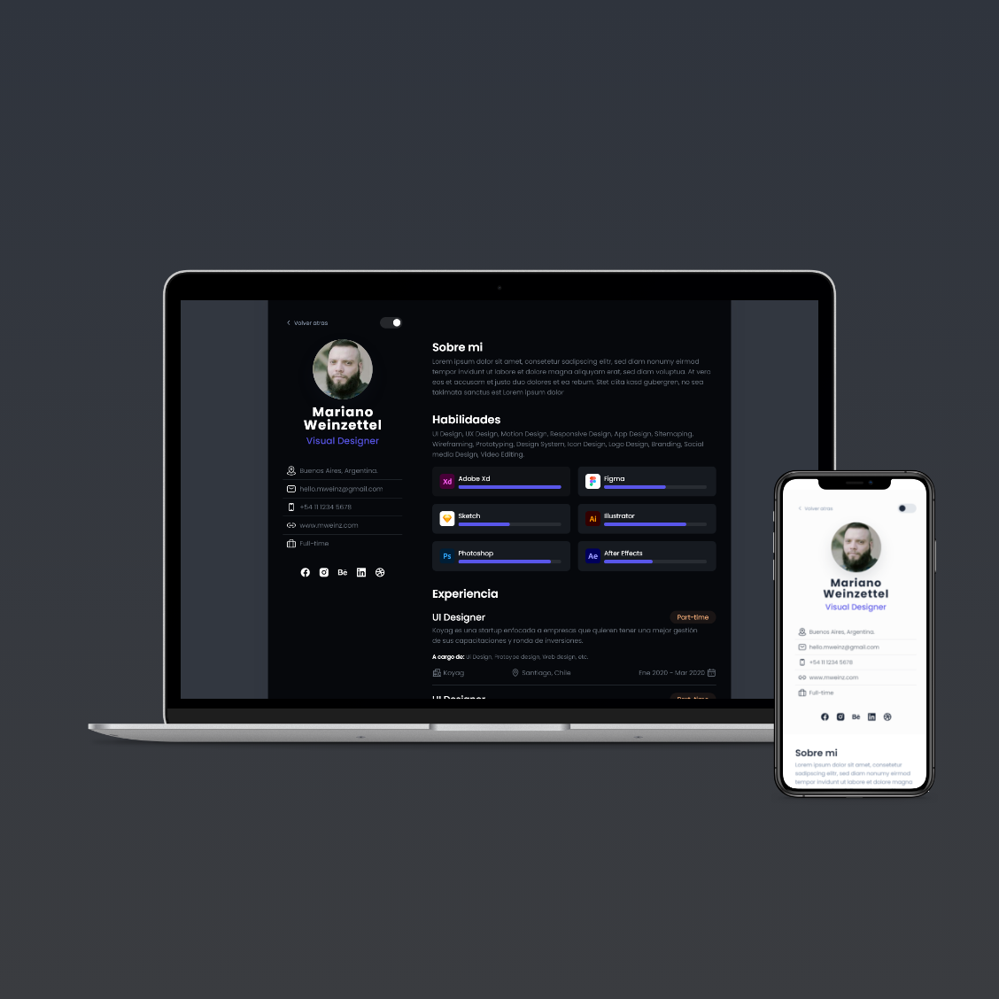

<!-- MUBIPLEX LOGO -->
 

  

  <h3 align="center">CV Fedevcode</h3>
  

    <a href="http://cv-fedevcode.com">Ir a la Web</a>
    -
    <a href="https://bit.ly/3EFXyrp">Descargar PDF</a>
  

<!-- PROJECT PREVIEW -->
## Previsualización

    

<!-- CREATED WITH -->
### Creada con:

* HTML
* CSS (SASS)
* BEM
* JAVASCRIPT

<a href="#top">Volver arriba</a>

<!-- CONTACT -->
## Contacto

* Fedevcode - [Todas mis redes](https://linktr.ee/fedevcode)  
* Email - info@fedevcode.com

<a href="#top">Volver arriba</a>

<!-- OTHER PROJECTS -->
## Otros proyectos

* Portfolio - [Portfolio](https://fedevcode.com)  
* Portfolio Repo - [Repo]()   
* Mubiplex Concepto - [Mubiplex](http://mubiplex.fedevcode.com/)  
* Mubiplex Repo - [Repo](https://github.com/fedevcode/Mubiplex-Concept)  

<a href="#top">Volver arriba</a>

<!-- GRATITUDE -->
## Agradecimientos

* Mariano Weinzettel - Freelance UI Designer [Behance](https://www.behance.net/mweinz?isa0=1) - [Instagram](https://www.instagram.com/marianoweinz/) - [Linkedin](https://ar.linkedin.com/in/mweinz?trk=public_profile_browsemap_profile-result-card_result-card_full-click)  
* Romina Peralta - UX Desinger Trainee [Behance](https://www.behance.net/rominaperaltaux) -  [Linkedin](https://ar.linkedin.com/in/rominaperaltaux?trk=public_profile_browsemap)

<a href="#top">Volver arriba</a>

